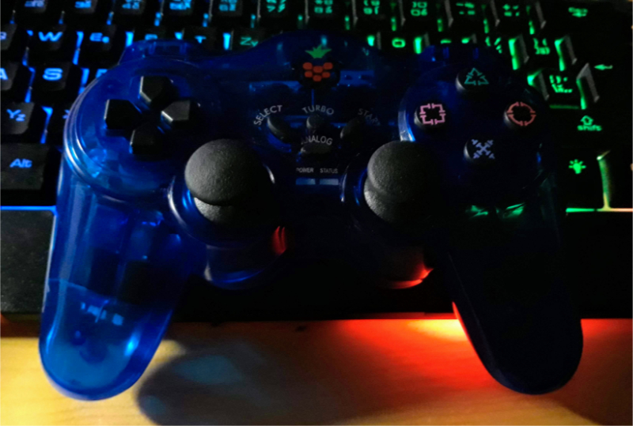

# joycontrol

Forked from the https://github.com/mart1nro/joycontrol project. Added the following features:

* Added REST backend for the original controller
* `joyapi.py` client for the REST backend
* supports keyboard controller, SNES like controller and RPI PS3-like controller

Tested on Raspberry PI 3B+ and Raspberry PI Zero WH

## Quick Start

* `./install`
* `./run.sh`

## Issues
- Some bluetooth adapters seem to cause disconnects for reasons unknown, try to use an usb adapter instead 
- Incompatibility with Bluetooth "input" plugin requires a bluetooth restart, see [#8](https://github.com/mart1nro/joycontrol/issues/8)
- It seems like the Switch is slower processing incoming messages while in the "Change Grip/Order" menu.
  This causes flooding of packets and makes pairing somewhat inconsistent.
  Not sure yet what exactly a real controller does to prevent that.
  A workaround is to use the reconnect option after a controller was paired once, so that
  opening of the "Change Grip/Order" menu is not required.
- ...

## Resources

[Nintendo_Switch_Reverse_Engineering](https://github.com/dekuNukem/Nintendo_Switch_Reverse_Engineering)

[console_pairing_session](https://github.com/timmeh87/switchnotes/blob/master/console_pairing_session)

